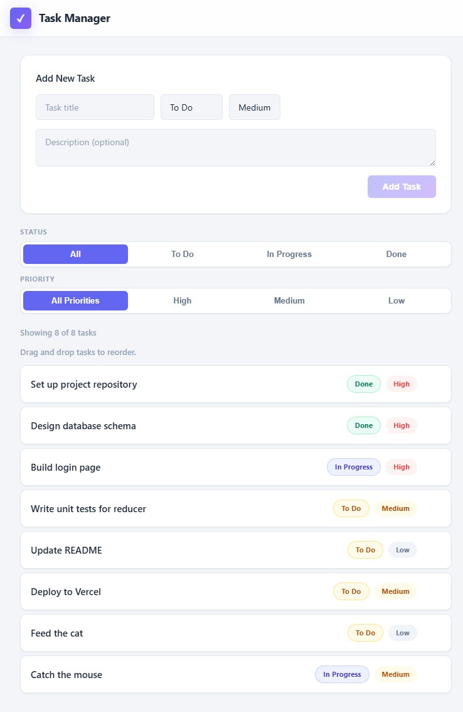

# Task Manager

A React + Vite task manager app with:
- Add task form (title, status, priority, description)
- Status filtering (All, To Do, In Progress, Done)
- Task list with priority/status badges and delete action
- Task detail page using React Router

## Install and run

1. Install dependencies:
   ```bash
   npm install
   ```
2. Start the development server:
   ```bash
   npm run dev
   ```
3. Open the app in your browser (usually at `http://localhost:5173`).

## Screenshot



## Bonus challenges completed

- Show a task count summary above the list: "Showing X of Y tasks"
- Disable the Add Task form's submit button while any required field is empty
- Persist tasks in localStorage so they survive a page reload (use a lazy useState initialiser or useEffect in TaskContext)
- Add an UPDATE_TASK action and an inline edit form on the detail page
- Add drag-and-drop reordering of tasks in the list using only browser drag events (no library)
- Add a priority filter on top of the status filter, so both can be active at the same time

## Tools used

- Copilot
- Gemini
